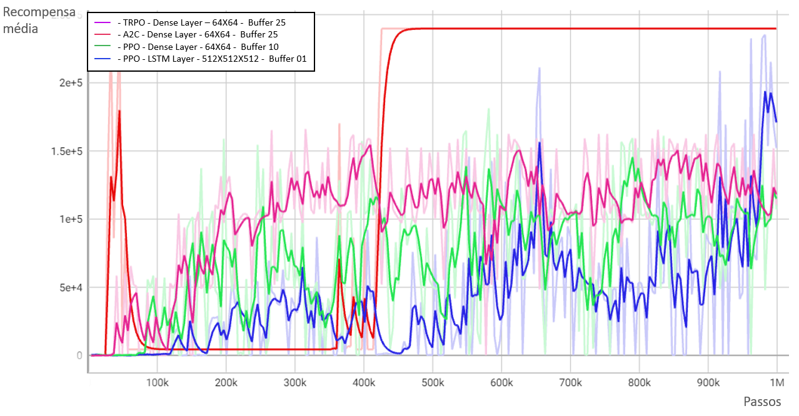

# Dados estatísticos de recompensas médias de cada modelo aplicado à esteira de caixa de latas:

| Nome | Mínimo | Máximo | Média | Desvio padrão | Conclusão do processo |
|------|--------|--------|-------|---------------|-----------------------|
| DQN buffer 01 - Dense Layer - 64 X 64 | 3413 | 202906 | 18701 | 21473 | Não |
| DQN buffer 10 - Dense Layer - 64 X 64 | 7222 | 193648 | 22444 | 31288 | Não |
| DQN buffer 25 - Dense Layer - 64 X 64 | 8784 | 232109 | 33398 | 41989 | Não |
| DQN buffer 25 - Dense Layer - 128 X 128 X 128 | 7199 | 175890 | 16316 | 14694 | Não |
| DQN buffer 25 - LSTM Layer - 128 X 128 X 128 | 0 | 20693 | 8388 | 5749 | Não |
| DQN buffer 25 - LSTM Layer - 128 X 96 X 128 X 96 | 282 | 186757 | 12134 | 16824 | Não |
| CEM buffer 01 - Dense Layer - 64 X 64 | 7660 | 181288 | 24876 | 20746 | Não |
| CEM buffer 10 - Dense Layer - 64 X 64 | 9086 | 196587 | 21620 | 24359 | Não |
| CEM buffer 25 - Dense Layer - 64 X 64 | 11038 | 224402 | 21672 | 17083 | Não |
| Sarsa buffer 01 - Dense Layer - 64 X 64 | 10841 | 211140 | 23551 | 27895 | Não |
| Sarsa buffer 10 - Dense Layer - 64 X 64 | 11535 | 187210 | 21951 | 20650 | Não |
| Sarsa buffer 25 - Dense Layer - 64 X 64 | 7660 | 181288 | 24876 | 20746 | Não |
| TRPO buffer 01 - Dense Layer - 64 X 64 | 0 | 214910 | 80877 | 70193 | Não |
| TRPO buffer 03 - Dense Layer - 64 X 64 | 0 | 54881 | 4802 | 11998 | Não |
| TRPO buffer 10 - Dense Layer - 64 X 64 | 97 | 48762 | 834 | 3086 | Não |
| TRPO buffer 25 - Dense Layer - 64 X 64 | 97 | 166196 | 102600 | 45178 | Sim |
| A2C buffer 01 - Dense Layer - 64 X 64 | 195 | 289 | 197 | 6 | Não |
| A2C buffer 03 - Dense Layer - 64 X 64 | 0 | 594 | 72 | 142 | Não |
| A2C buffer 10 - Dense Layer - 64 X 64 | 196 | 923 | 690 | 173 | Não |
| A2C buffer 25 - Dense Layer - 64 X 64 | 197 | 246902 | 146726 | 11334 | Sim |
| PPO buffer 01 - Dense Layer - 64 X 64 | 195 | 148592 | 24230 | 35380 | Não |
| PPO buffer 01 - LSTM Layer - 64 X 64 | 0 | 1252 | 436 | 212 | Não |
| PPO buffer 01 - LSTM Layer - 256 X 256 X 256 | 31 | 65976 | 1461 | 6125 | Não |
| PPO buffer 01 - LSTM Layer - 512 X 512 X 512 | 196 | 235370 | 43370 | 52112 | Não |
| PPO buffer 03 - Dense Layer - 64 X 64 | 95 | 1284 | 804 | 148 | Não |
| PPO buffer 03 - LSTM Layer - 64 X 65 | 126 | 1381 | 698 | 297 | Não |
| PPO buffer 10 - Dense Layer - 64 X 64 | 30 | 181410 | 72221 | 49063 | Não |
| PPO buffer 10 - LSTM Layer - 64 X 65 | 0 | 1581 | 923 | 345 | Não |
| PPO buffer 25 - Dense Layer - 64 X 64 | 98 | 58596 | 1489 | 4978 | Não |
| PPO buffer 25 - LSTM Layer - 64 X 65 | 0 | 1186 | 666 | 242 | Não |

## Recompensa média dos melhores modelos aplicados à esteira de caixa de latas:

# Dados estatísticos de recompensas médias de cada modelo aplicado à garra manipuladora de caixas:

| Nome | Mínimo | Máximo | Média | Desvio padrão | Conclusão do processo | Porcentagem de preenchimento |
|------|--------|--------|-------|---------------|-----------------------|-----------------------------|
| DQN buffer 01 - Dense Layer - 64 X 64 | -137152 | -70639 | -108994 | 9103 | Não | - |
| DQN buffer 10 - Dense Layer - 64 X 64 | -132550 | -54325 | -108946 | 11157 | Não | - |
| DQN buffer 25 - Dense Layer - 64 X 64 | -139624 | -83250 | -110709 | 9625 | Não | - |
| TRPO buffer 01 - Dense Layer - 64 X 64 | -10767 | 79016 | 61459 | 14491 | Parcialmente | 33% |
| TRPO buffer 03 - Dense Layer - 64 X 64 | -16181 | 81642 | 61631 | 20465 | Parcialmente | 67% |
| TRPO buffer 10 - Dense Layer - 64 X 64 | -11210 | 82889 | 61975 | 20969 | Sim | 100% |
| TRPO buffer 25 - Dense Layer - 64 X 64 | -11094 | 82380 | 54253 | 26881 | Parcialmente | 44% |
| A2C buffer 01 - Dense Layer - 64 X 64 | -167 | 0 | -25 | 61 | Não | - |
| A2C buffer 03 - Dense Layer - 64 X 64 | -396 | 59 | -3 | 30 | Não | - |
| A2C buffer 10 - Dense Layer - 64 X 64 | -167 | 0 | -2 | 17 | Não | - |
| A2C buffer 25 - Dense Layer - 64 X 64 | -167 | 0 | -2 | 18 | Não | - |
| PPO buffer 01 - Dense Layer - 64 X 64 | -12354 | 33040 | 5069 | 5142 | Não | - |
| PPO buffer 01 - LSTM Layer - 64 X 64 | -13647 | 1289 | -232 | 1594 | Não | - |
| PPO buffer 01 - LSTM Layer - 256 X 256 X 256 | -9425 | 0 | -2356 | 4713 | Não | - |
| PPO buffer 01 - LSTM Layer - 512 X 512 X 512 | -10713 | 0 | -49 | 717 | Não | - |
| PPO buffer 01 - LSTM Layer - 1028 X 1028 X 1028 | -8035 | 0 | -15 | 503 | Não | - |
| PPO buffer 03 - Dense Layer - 64 X 64 | -13103 | 39842 | 9741 | 7705 | Não | - |
| PPO buffer 10 - Dense Layer - 64 X 64 | -38703 | 71674 | 40331 | 19410 | Parcialmente | 33% |
| PPO buffer 25 - Dense Layer - 64 X 64 | -11843 | 25761 | 5571 | 4745 | Não | - |

## Recompensa média dos melhores modelos aplicados à garra manipuladora de latas:

