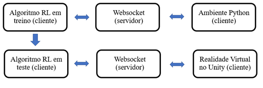

# Aprendizagem por Reforço Aplicada ao Processo de Empacotamento de Latas 

Todos os algoritmos são preferencialmente pré treinados em ambientes programados em Python para posterior simulação na realidade virtual no Unity, ocorrendo a troca de informações entre o agente e esse ambiente por meio de comunicação Websocket. 

Tal preferência pelo pré treinamento nessas bibliotecas se deu pela superioridade de velocidade de processamento computacional e pela maior disponibilidade e flexibidade de algoritmos quando comparados a um treino feito no Unity, pela biblioteca ML-Agents Toolkit. A utilização da  Websocket é necessária por haver programação de códigos em scripts distintos na realidade virtual e nas bibliotecas de RL. A troca de informações entre o agente e o ambiente via Websocket ocorre dessa forma por meio de protocolo TCP/IP, em uma conexão cliente e servidor, gerida por um terceiro algoritmo. Por sua vez, essa utilização resulta na desacoplagem entre os código de simulação e treino, permitindo mudanças e adequações sem que haja interferência de um no outro durante o desenvolvimento.

# Bibliotecas de Aprendizagem por Reforço:

| Biblioteca | Descrição | Link |
| --- | --- | --- |
| Gym | Biblioteca de aprendizagem por reforço | https://www.gymlibrary.dev  |
| Stable Baselines3 | Implementações de algoritmos de aprendizagem por reforço | https://stable-baselines3.readthedocs.io/en/master/ |
| PyTorch | Biblioteca de aprendizagem de máquina baseada em Torch | https://pytorch.org/ |
| TensorFlow | Biblioteca de aprendizagem de máquina desenvolvida pela Google | https://www.tensorflow.org/ |
| SB3_contrib | Biblioteca de contribuições para o Stable Baselines3 | https://stable-baselines3.readthedocs.io/en/master/guide/sb3_contrib.html |
| Torchvision | Biblioteca de visão computacional baseada em PyTorch | https://pytorch.org/vision/stable/index.html |
| Callbacks | Callbacks para serem usados com o Stable Baselines3 | https://stable-baselines3.readthedocs.io/en/master/guide/callbacks.html |
| TensorBoard | Biblioteca para visualização de dados do TensorFlow | https://www.tensorflow.org/tensorboard |

# Bibliotecas de WebSocket:

| Biblioteca | Descrição | Link |
| --- | --- | --- |
| WebSocket | Implementação de servidor e cliente WebSocket em Python | https://websockets.readthedocs.io/en/stable/ |
| Json | Biblioteca para codificar e decodificar dados JSON em Python | https://docs.python.org/3/library/json.html |

# Pacotes e instalação do Unity:

| Biblioteca | Descrição | Link |
| --- | --- | --- |
| Unity | Plataforma de desenvolvimento de jogos | https://unity.com/ |
| Assets | Recursos para serem usados no Unity | https://assetstore.unity.com/ |

# Bibliotecas de Utilitários:

| Biblioteca | Descrição | Link |
| --- | --- | --- |
| Os | Biblioteca para interagir com o sistema operacional | https://docs.python.org/3/library/os.html |
| Psutil | Biblioteca para obter informações do sistema operacional | https://psutil.readthedocs.io/en/latest/ |
| Subprocess | Biblioteca para criar processos no sistema operacional | https://docs.python.org/3/library/subprocess.html |
| Random | Biblioteca para geração de números aleatórios | https://docs.python.org/3/library/random.html |
| Time | Biblioteca para trabalhar com tempo em Python | https://docs.python.org/3/library/time.html |
| Tqdm | Biblioteca para mostrar progresso em loops | https://tqdm.github.io/ |
| Cuda | Plataforma de computação paralela da Nvidia | https://developer.nvidia.com/cuda-zone |
