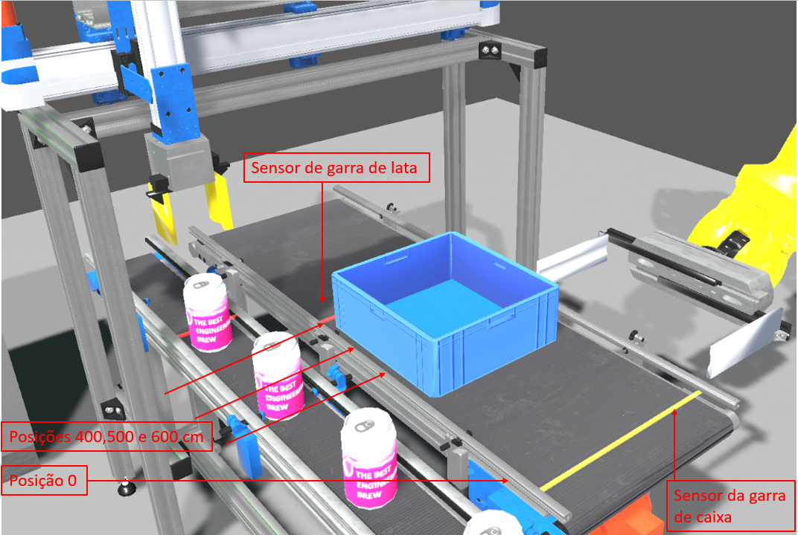

# Introdução 

A esteira de caixa de latas é um sistema que consiste em posicionar essa caixa nos pontos pré-determinados para recebimento de latas preenchidas por uma garra que movimenta-se com dois graus de liberdade (esquerda-direita, cima-baixo). São colocadas um total de 9 latas, distribuídas em 3 filas de 3 latas, no qual a caixa que recebe essas latas, por meio de um terceiro grau de liberdade (frente-trás) ,  precisa ser movida pela passadeira para concluir o preenchimento.  É composta por um motor, dois sensores de fim de curso e um sensor de posicionamento da caixa e é movida da posição zero, onde se situa a tomada da caixa por uma garra robótica, para as posições 400, 500 e 600 cm, pontos estes de recebimento de latas pela garra de latas. Ao finalizar o enchimento, a esteira retorna a caixa para a posição de retoma da garra robótica, que por sua vez esvazia a caixa, refazendo o ciclo de enchimento. 

É permitido a esteira realizar 3 tipos diferentes de ações discretas:

•	Parar; 
•	Movimentar para frente; 
•	Movimentar para trás. 

Por sua vez, o processo recebe informações de estado  de 4 variáveis: 

•	Sensor de fim de curso do robô de esvaziameneto da caixa (variável discreta); 
•	Sensor de fim de curso da posição da garra de manipulação de latas (variável discreta); 
•	Sinal discreto enviado pela garra de manipulação de latas indicando que a fileira foi preenchida; 
•	Sinal de posição da caixa no percurso da esteira, variando de 0 a 600 cm.  

# Para treinamento da esteira de caixa de latas:

## Abra o Jupyter Notebook:

Se você instalou o Anaconda, abra o Anaconda Navigator e clique no botão "Launch" para o Jupyter Notebook. 
Se você instalou o Python e o Jupyter Notebook usando o pip, abra o terminal ou prompt de comando e digite o comando "python -m notebook". 
No Linux ou macOS, abra o terminal e digite o comando "python -m notebook". 

Independentemente do método escolhido, após o Jupyter Notebook ser iniciado, ele abrirá uma página da web no seu navegador padrão com o endereço "http://localhost:8888/tree". A partir daí, você pode criar um novo notebook ou abrir um já existente.

## Ative o servidor websocket:

Todos os processos de treino e teste requerem ativação do servidor websocket para gestão de comunicação entre agente (cliente) e ambiente (servidor). Para isto siga os passos seguintes:

### 1- Abra o notebook Socket Communication:

Executar o ficheiro no diretório DigitalTwinRL/Socket/Socket Communication.ipynb 

### 2- Execute o servidor websocket:

Basta correr a primeira célula do notebook e o ficheiro python irá ativar conexão TCP/IP local, porta 12000. Caso já esteja ativo e a célula for executada novamente, a conexão será desativada. Em todo treinamento ou teste, deve-se certificar que a conexão esteja ativa.

## Gerar o ambiente de treinamento da esteira de caixa de latas:

### 1- Abra o notebook de ambiente:

Executar o ficheiro no diretório DigitalTwinRL/Enviroment/BoxConveyor_enviroment.ipynb

### 2- Prepare o ambiente de treinamento:

Execute as células abaixo de criação do ambiente:

1 - Importa bibliotecas; 
2 - Cria funções de encoding/decoding em json; 
3 - Define função do ambiente de treino. 

### 3- Verifique a conexão websocket:

Execute a célula 4 "Verifica se o servidor socket está ativo" para checar se o servidor está ativo. Caso não esteja, verifique o notebook Socket Communication.ipynb nos passos anteriores.

### 4- Ative o ambiente de treinamento:

Execute a célula 5 "Ativa o ambiente para treino". A célula ficará permanentemente a correr, aguardando comandos do agente. Um log ações é exebido abaixo da célula durante o treinamento do agente.

## Treinar o agente da esteira de caixa de latas:

### 1- Abra o notebook de treinamento do agente:

Executar o ficheiro no diretório DigitalTwinRL/Agent/BoxConveyor_Agent.ipynb

### 2- Prepare o agente para o treinamento:

Execute as células abaixo de criação do agente:

1 - Importa bibliotecas; 
2 - Cria funções de encoding/decoding em json; 
3 - Define função de criação do agente. 

### 3- Crie o modelo de Apendizagem por Reforço:

Defina valores, parâmetros e execute a célula 4 "Cria o modelo em Aprendizagem por Reforço". Abaixo segue a descrição de cada variável a definir:

- algoritmo: Especifica o algoritmo de aprendizagem por reforço a ser utilizado para treinar o modelo de rede neuronal; 
- nome_do_ficheiro: Nome do arquivo a ser salvo após o treinamento do modelo; 
- tamanho_buffer: Define o tamanho do buffer utilizado pelo algoritmo de aprendizado por reforço. O buffer é uma estrutura de dados que armazena amostras de experiência que serão usadas para treinar o modelo em lotes; 
- funcao_ativacao:  Especifica a função de ativação a ser usada nas camadas da rede neuronal. As funções de ativação são usadas para adicionar não-linearidade aos modelos de rede neuronal e podem afetar significativamente o desempenho do modelo; 
- rede_neuronal:  Define a arquitetura da rede neural que será utilizada no modelo, especificando o número de neurónios nas camadas de política e valor da rede neuronal. ver: https://stable-baselines3.readthedocs.io/en/master/guide/custom_policy.html;
- tipo_camadas:   Define o tipo de camadas do modelo; 
- fator_desconto:  Especifica o fator de desconto utilizado na aprendizagem por reforço. Este fator é utilizado para controlar a importância que as recompensas futuras têm sobre as recompensas atuais. Quanto maior o fator de desconto, maior será a importância das recompensas futuras; 
- save_path:  Define o caminho onde o modelo será salvo após o treinamento. Esta variável é construída concatenando-se vários elementos, como o diretório onde os modelos são salvos, o nome do arquivo e o tamanho do buffer utilizado durante o treinamento. 

### 4- Define funções de callback:

A execução da célula 5 "Define funções de callback" cria diretórios dentro de DigitalTwinRL\Agent\BoxConveyor que permitem gerar logs e salvar modelos durante o treinamento. Os logs descrevem a performance do agente durante o treinamento e podem ser visualizados por meio do Tensorboard. Ver link: https://stable-baselines3.readthedocs.io/en/master/guide/tensorboard.html

### 5- Inicie o treinamento do agente:

A execução da célula 6 "Inicia treino" realiza o treinamento do agente. Importante definir a quantidade de passos de treino em n_steps.

### 6- Salve o modelo (se desejar):

A execução da célula 7 "Salva o modelo (caso necessário)" salva o modelo no diretório definido em save_path.

# Para teste do agente treinado

### 1- Carregue um modelo do diretório (se desejar):

A execução da célula 8 "Carrega o modelo (caso necessário)" carrega um modelo salvo previamente em diretório. os parâmetros seguintes devem ser definidos na célula:

- nome_do_ficheiro_carregar: Nome do arquivo a ser carregado, referente ao modelo treinado com o algoritmo; 
- algoritmo_carregar: O algoritmo que será carregado; 
- tamanho_buffer_carregar: O tamanho do buffer que foi utilizado para treinar o modelo que será carregado. 

### 2- Certifique que a conexão websocket esteja ativa:

Reabra a conexão ou certifique que esteja ativa. Descrição no início deste tutorial.

### 3- Carregue a realidade virtual:

Execute o ficheiro DigitalTwinRL\Virtual_Reality\DigitalTwinRL.exe que irá iniciar a realidade virtual. 

### 4- Inicie o teste do agente:

A execução da célula 9 "Utiliza modelo treinado no ambiente" executa o modelo treinado em Aprendizagem por Reforço para acionamento da esteira de caixa de latas na realidade virtual.  

As linhas de código "mensagem = encode_json('Handling_automatico', [])" podem ser alteradas para manter o comando da esteira de latas e garra manipuladora de latas no modo manual ou modo automático, conforme necessidade do usuário. 

